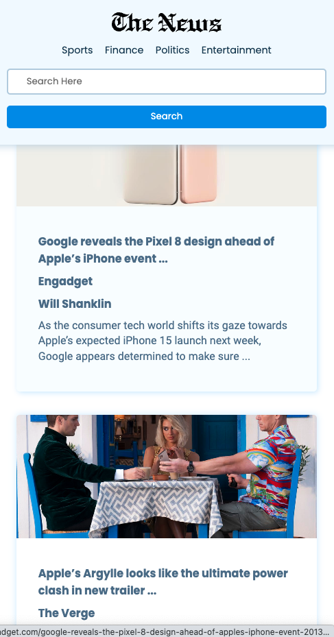

## News Search Web App


### Install

```bash
npm install
npm run dev
```
### Built With 
  

### Features
- Fully responsive web app compatible with mobile, tablet and desktop devices
- Includes news search Functionality
- Fetches data from  `https://newsapi.org/`
- All DOM elements within `cards-container` generated using `JS`

### Set API Key

- To query data from NewsAPI , get your API key and save it within the `.env` file in your project directory


```
VITE_API_KEY= "Input API Key here"
```

### Responsive Layout

<b>Tablet View</b>


<b>Mobile View</b>




